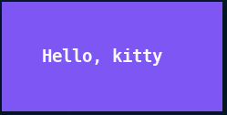
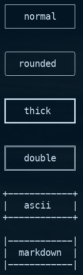
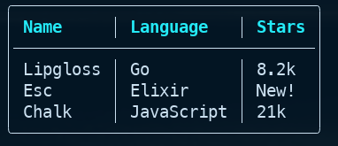
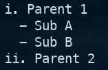
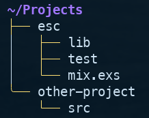

# Esc

[](https://elixir-lang.org) [](https://hex.pm/packages/esc) [](https://github.com/vectorfrog/esc/blob/main/LICENSE)

Declarative terminal styling for Elixir, inspired by [Lipgloss](https://github.com/charmbracelet/lipgloss).

Esc provides an expressive, composable API for styling terminal output with colors, borders, padding, margins, and alignment. It also includes components for tables, lists, trees, and interactive select menus.



```elixir
import Esc

style()
|> bold()
|> foreground("#FAFAFA")
|> background("#7D56F4")
|> padding(2, 4)
|> width(22)
|> render("Hello, kitty")
```

## Table of Contents

- [Installation](#installation)
- [Quick Start](#quick-start)
- [Colors](#colors)
- [Text Formatting](#text-formatting)
- [Borders](#borders)
- [Layout](#layout)
- [Style Management](#style-management)
- [Rendering Options](#rendering-options)
- [Tables](#tables)
- [Lists](#lists)
- [Trees](#trees)
- [Select](#select)
- [Themes](#themes)
- [Terminal Detection](#terminal-detection)
- [License](#license)

## Installation

Add `esc` to your list of dependencies in `mix.exs`:

```elixir
def deps do
  [
    {:esc, "~> 0.8.0"}
  ]
end
```

Esc requires Elixir 1.15 or later. See [Hex.pm](https://hex.pm/packages/esc) for the latest version.

## Quick Start

The simplest way to get started is by importing `Esc` and chaining style functions:

```elixir
import Esc

style()
|> bold()
|> foreground("#FAFAFA")
|> background("#7D56F4")
|> padding(2, 4)
|> width(22)
|> render("Hello, kitty")
```

Style is composable, so you can build styles incrementally:

```elixir
import Esc

base_style = style() |> bold() |> foreground(:cyan)

base_style |> render("Standard")
base_style |> background(:blue) |> render("With background")
```

## Colors

Esc supports multiple color formats:

```elixir
import Esc

# Named ANSI colors
style() |> foreground(:red) |> render("Red text")
style() |> foreground(:bright_cyan) |> render("Bright cyan")

# ANSI 256 palette (0-255)
style() |> foreground(196) |> render("Color 196")

# True color (24-bit RGB)
style() |> foreground({255, 128, 0}) |> render("Orange")

# Hex strings
style() |> foreground("#ff8000") |> render("Also orange")

# Background colors work the same way
style() |> background(:blue) |> foreground(:white) |> render("White on blue")
```

### Adaptive Colors

Adaptive colors automatically select between variants based on terminal background:

```elixir
alias Esc.Color

# First arg for light backgrounds, second for dark
color = Color.adaptive("#000000", "#ffffff")
```

### Complete Colors

Specify exact colors for each terminal capability level:

```elixir
color = Color.complete(
  ansi: :red,
  ansi256: 196,
  true_color: {255, 0, 0}
)
```

## Text Formatting

```elixir
style() |> bold() |> render("Bold")
style() |> italic() |> render("Italic")
style() |> underline() |> render("Underlined")
style() |> strikethrough() |> render("Struck through")
style() |> faint() |> render("Faint/dim")
style() |> blink() |> render("Blinking")
style() |> reverse() |> render("Reversed colors")

# Combine multiple styles
style()
|> bold()
|> italic()
|> foreground(:cyan)
|> render("Bold italic cyan")
```

## Borders



```elixir
# Available styles: :normal, :rounded, :thick, :double, :ascii, :markdown, :hidden
style() |> border(:rounded) |> render("Rounded box")

# Border colors
style()
|> border(:double)
|> border_foreground(:cyan)
|> render("Cyan double border")

# Per-side border control
style()
|> border(:normal)
|> border_top(true)
|> border_bottom(true)
|> border_left(false)
|> border_right(false)
|> render("Top and bottom only")

# Custom border characters
style()
|> custom_border(
  top: "=", bottom: "=",
  left: "|", right: "|",
  top_left: "+", top_right: "+",
  bottom_left: "+", bottom_right: "+"
)
|> render("Custom border")
```

## Layout

### Padding and Margins

```elixir
# All sides
style() |> padding(2) |> render("Padded")

# Vertical, horizontal
style() |> padding(1, 4) |> render("More horizontal padding")

# Top, right, bottom, left
style() |> padding(1, 2, 1, 2) |> render("CSS-style")

# Margins work the same way
style() |> margin(1, 2) |> render("Margined")
```

### Dimensions and Alignment


```elixir
# Fixed width (content padded/truncated to fit)
style() |> width(30) |> render("Fixed width")

# Fixed height
style() |> height(5) |> render("Fixed height")

# Horizontal alignment: :left, :center, :right
style() |> width(30) |> align(:center) |> render("Centered")

# Vertical alignment: :top, :middle, :bottom
style() |> height(5) |> vertical_align(:middle) |> render("Middle")
```

### Joining Blocks


```elixir
left = style() |> border(:rounded) |> render("Left")
right = style() |> border(:rounded) |> render("Right")

# Horizontal join with vertical alignment (:top, :middle, :bottom)
Esc.join_horizontal([left, right], :top)

# Vertical join with horizontal alignment (:left, :center, :right)
Esc.join_vertical([left, right], :center)
```

### Placement

```elixir
# Place text in a box of specific dimensions
Esc.place(40, 10, :center, :middle, "Centered in 40x10 box")

# Horizontal/vertical placement only
Esc.place_horizontal(40, :right, "Right-aligned in 40 chars")
Esc.place_vertical(10, :bottom, "At bottom of 10 lines")
```

### Measurement

```elixir
text = "Hello\nWorld"
Esc.get_width(text)   # => 5 (widest line)
Esc.get_height(text)  # => 2 (line count)
```

## Style Management

### Inheritance

```elixir
base = style() |> foreground(:red) |> bold() |> padding(1)

# Inherit unset properties from base
derived = style() |> foreground(:blue) |> inherit(base)
# Result: blue (overridden), bold (inherited), padding 1 (inherited)
```

### Unsetting Properties

```elixir
style()
|> bold()
|> foreground(:red)
|> unset_foreground()  # Remove the red
|> render("Just bold")

# Available: unset_foreground, unset_background, unset_bold, unset_italic,
# unset_underline, unset_padding, unset_margin, unset_border, unset_width, etc.
```

## Rendering Options

### Inline Mode

```elixir
# Strips newlines, ignores width/height constraints
style()
|> inline(true)
|> render("Line 1\nLine 2")  # => "Line 1 Line 2"
```

### Max Dimensions

```elixir
# Truncate content exceeding limits
style() |> max_width(20) |> render("Very long text...")
style() |> max_height(3) |> render("Many\nlines\nof\ntext")
```

### No Color Mode

```elixir
# Strip all ANSI codes (preserves layout)
style()
|> foreground(:red)
|> border(:rounded)
|> no_color(true)
|> render("No colors, but has border")
```

### Custom Renderers

```elixir
upcase_renderer = fn text, _style -> String.upcase(text) end

style()
|> renderer(upcase_renderer)
|> render("hello")  # => "HELLO"
```

## Tables

```elixir
alias Esc.Table

Table.new()
|> Table.headers(["Name", "Language", "Stars"])
|> Table.row(["Lipgloss", "Go", "8.2k"])
|> Table.row(["Esc", "Elixir", "New!"])
|> Table.row(["Chalk", "JavaScript", "21k"])
|> Table.border(:rounded)
|> Table.header_style(Esc.style() |> Esc.bold() |> Esc.foreground(:cyan))
|> Table.render()
```



### Table Options

```elixir
Table.new()
|> Table.headers(["Col 1", "Col 2"])
|> Table.rows([["A", "B"], ["C", "D"]])  # Add all rows at once
|> Table.border(:normal)                  # Border style
|> Table.header_style(style)              # Style for headers
|> Table.row_style(style)                 # Style for all rows
|> Table.style_func(fn row, col -> ... end)  # Per-cell styling
|> Table.width(0, 20)                     # Min width for column 0
|> Table.render()
```

## Lists

```elixir
alias Esc.List, as: L

L.new(["First item", "Second item", "Third item"])
|> L.enumerator(:arabic)  # 1. 2. 3.
|> L.item_style(Esc.style() |> Esc.foreground(:green))
|> L.render()
```

Output:
```text
1. First item
2. Second item
3. Third item
```

### Enumerator Styles

```elixir
L.enumerator(:bullet)    # • Item
L.enumerator(:dash)      # - Item
L.enumerator(:arabic)    # 1. 2. 3.
L.enumerator(:roman)     # i. ii. iii.
L.enumerator(:alphabet)  # a. b. c.

# Custom enumerator function
L.enumerator(fn idx -> "[#{idx + 1}] " end)
```

### Nested Lists

```elixir
nested = L.new(["Sub A", "Sub B"]) |> L.enumerator(:dash)

L.new(["Parent 1", nested, "Parent 2"])
|> L.enumerator(:bullet)
|> L.render()
```



## Trees

```elixir
alias Esc.Tree

Tree.root("~/Projects")
|> Tree.child(
  Tree.root("esc")
  |> Tree.child("lib")
  |> Tree.child("test")
  |> Tree.child("mix.exs")
)
|> Tree.child("other-project")
|> Tree.enumerator(:rounded)
|> Tree.root_style(Esc.style() |> Esc.bold())
|> Tree.render()
```



### Tree Options

```elixir
Tree.new()                        # Empty tree
Tree.root("Label")                # Tree with root
Tree.child(tree, "text")          # Add string child
Tree.child(tree, subtree)         # Add nested tree
Tree.enumerator(:default)         # ├── └──
Tree.enumerator(:rounded)         # ├── ╰──
Tree.root_style(style)            # Style for root node
Tree.item_style(style)            # Style for children
Tree.enumerator_style(style)      # Style for connectors
```

## Select

Interactive selection menus for CLI applications. Users navigate with arrow keys (or j/k) and confirm with Enter.

> **Requires OTP 28+** - The Select component uses OTP 28's native raw terminal mode. See [OTP 28 Setup](#otp-28-setup) below.

```elixir
alias Esc.Select

case Select.new(["Option A", "Option B", "Option C"]) |> Select.run() do
  {:ok, choice} -> IO.puts("You selected: #{choice}")
  :cancelled -> IO.puts("Cancelled")
end
```

### Items with Return Values

Items can be tuples of `{display_text, return_value}`:

```elixir
environments = [
  {"Production", :prod},
  {"Staging", :staging},
  {"Development", :dev}
]

case Select.new(environments) |> Select.run() do
  {:ok, env} -> deploy_to(env)  # env is :prod, :staging, or :dev
  :cancelled -> IO.puts("Cancelled")
end
```

### Styling

```elixir
Select.new(["Phoenix", "Plug", "Bandit"])
|> Select.cursor("❯ ")                                    # Custom cursor
|> Select.cursor_style(Esc.style() |> Esc.foreground(:cyan))
|> Select.selected_style(Esc.style() |> Esc.bold())
|> Select.item_style(Esc.style() |> Esc.foreground(:white))
|> Select.run()
```

### Theme Integration

Select automatically uses theme colors when a global theme is set:

```elixir
Esc.set_theme(:dracula)

# Cursor uses :emphasis, selected item uses :header
Select.new(["A", "B", "C"]) |> Select.run()

# Disable theme colors
Select.new(["A", "B", "C"]) |> Select.use_theme(false) |> Select.run()
```

### Keyboard Controls

| Key | Action |
|-----|--------|
| `↑` / `k` | Move up |
| `↓` / `j` | Move down |
| `Enter` / `Space` | Confirm selection |
| `q` / `Escape` | Cancel |
| `g` / `Home` | Jump to first |
| `G` / `End` | Jump to last |
| `/` | Enter filter mode |
| `]` / `Ctrl+F` | Next page |
| `[` / `Ctrl+B` | Previous page |

### Pagination

For large lists, items are automatically paginated (default: 100 items per page). Use `]`/`[` or `Ctrl+F`/`Ctrl+B` to navigate between pages:

```elixir
# Large dataset with default pagination (100 per page)
items = for i <- 1..500, do: {"Item #{i}", i}
Select.new(items) |> Select.run()

# Custom page size
Select.new(items) |> Select.page_size(25) |> Select.run()

# Disable pagination (show all items)
Select.new(items) |> Select.page_size(0) |> Select.run()
```

The page indicator shows `[Page 1/5]` when multiple pages exist. Navigation with `j`/`k` automatically advances to the next/previous page at boundaries.

### OTP 28 Setup

The Select component requires Erlang/OTP 28 or later for native raw terminal mode support. We recommend using [asdf](https://asdf-vm.com/) to manage Erlang/Elixir versions:

```bash
# Install asdf plugins (if not already installed)
asdf plugin add erlang
asdf plugin add elixir

# Install OTP 28 and compatible Elixir
asdf install erlang 28.3
asdf install elixir 1.19.4-otp-28

# Set versions for your project (creates .tool-versions)
cd your_project
asdf local erlang 28.3
asdf local elixir 1.19.4-otp-28

# Verify
erl -eval 'erlang:display(erlang:system_info(otp_release)), halt().' -noshell
# Should output: "28"
```

Alternatively, add a `.tool-versions` file to your project:

```
erlang 28.3
elixir 1.19.4-otp-28
```

## Themes

Esc includes 12 built-in themes based on popular terminal color schemes. Set a theme globally to automatically apply colors to all components.

```elixir
# Set a global theme
Esc.set_theme(:dracula)

# Available themes
Esc.themes()
# => [:dracula, :nord, :gruvbox, :one, :solarized, :monokai,
#     :material, :github, :aura, :dolphin, :chalk, :cobalt]
```

### Theme Colors

Themes provide semantic colors for common UI purposes:

```elixir
Esc.set_theme(:nord)

# Use semantic colors in styles
style() |> Esc.theme_foreground(:error) |> render("Error message")
style() |> Esc.theme_foreground(:success) |> render("Success!")
style() |> Esc.theme_foreground(:warning) |> render("Warning")
style() |> Esc.theme_foreground(:header) |> render("Header text")
style() |> Esc.theme_foreground(:muted) |> render("Subdued text")

# Access theme colors directly
Esc.theme_color(:error)    # => {191, 97, 106}
Esc.theme_color(:success)  # => {163, 190, 140}
```

**Semantic colors:**
- `:header` - Headers, titles (cyan)
- `:emphasis` - Important text (blue)
- `:success` - Success messages (green)
- `:warning` - Warning messages (yellow)
- `:error` - Error messages (red)
- `:muted` - Subdued text, borders (gray)

### Auto-Themed Components

When a theme is set, Table, Tree, List, and Select components automatically use theme colors:

```elixir
Esc.set_theme(:dracula)

# Table headers use :header color, borders use :muted
Table.new()
|> Table.headers(["Name", "Status"])
|> Table.row(["Build", "Passing"])
|> Table.border(:rounded)
|> Table.render()

# Tree root uses :emphasis, connectors use :muted
Tree.root("Project")
|> Tree.child("src")
|> Tree.child("test")
|> Tree.render()

# List enumerators use :muted
List.new(["First", "Second", "Third"])
|> List.enumerator(:arabic)
|> List.render()
```

Disable auto-theming for specific components:

```elixir
Table.new()
|> Table.use_theme(false)  # Disable theme colors
|> Table.headers(["A", "B"])
|> Table.render()
```

### Theme Management

```elixir
Esc.set_theme(:nord)       # Set theme by name
Esc.get_theme()            # Get current theme struct
Esc.clear_theme()          # Clear theme (disable theming)
Esc.themes()               # List available theme names

# Configure default theme in config.exs
config :esc, theme: :dracula
```

## Terminal Detection

```elixir
# Detect color support
Esc.color_profile()  # :no_color | :ansi | :ansi256 | :true_color

# Detect background
Esc.has_dark_background?()  # true | false

# Force color output (ignores TTY detection)
Application.put_env(:esc, :force_color, true)
```

## License

MIT License - See [LICENSE](LICENSE) file for details.

Copyright (c) 2025 Vectorfrog
